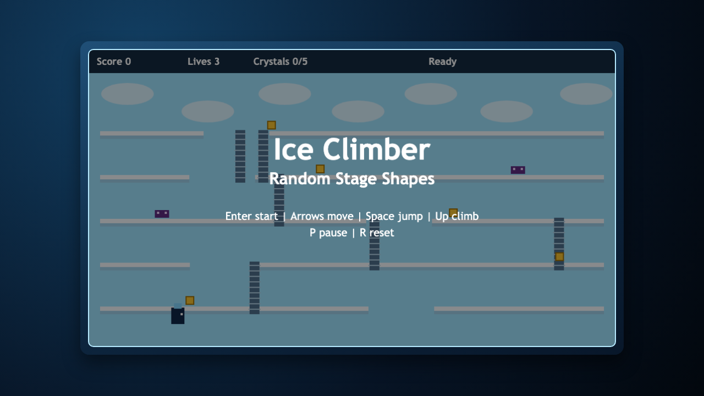
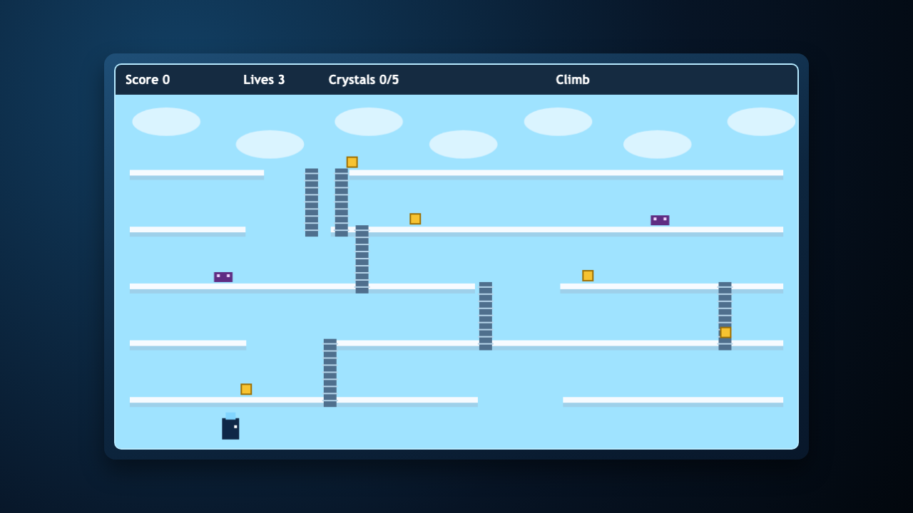
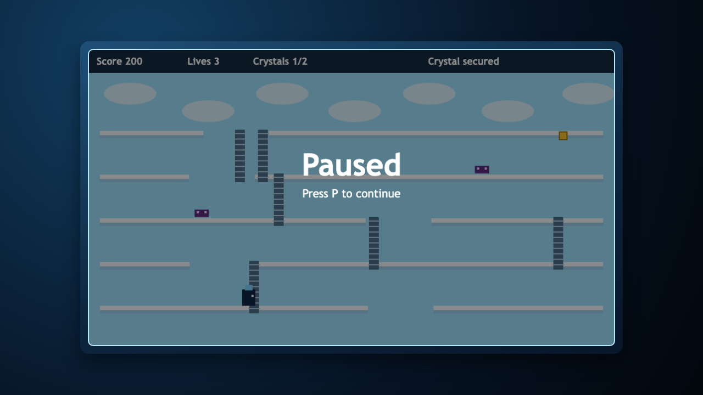

# daily-classic-game-2026-03-18-ice-climber-random-stage-shapes

<p align="center"><strong>Ice Climber rebuilt as a deterministic summit run with seeded Random Stage Shapes.</strong></p>

<p align="center">Climb shifting mountain layouts, collect all crystals, and survive roaming condors to clear the stage.</p>

<p align="center">
  
  
  
</p>

## GIF Captures
- `clip-title-to-start.gif`: title screen into active climb.
- `clip-random-stage-climb.gif`: deterministic crystal collection on seeded layout.
- `clip-pause-reset.gif`: pause and reset behavior during live run.

## Quick Start
```bash
pnpm install
pnpm test
pnpm build
pnpm capture
```

## How To Play
- Press `Enter` to start and restart.
- Move with `ArrowLeft` and `ArrowRight`.
- Jump with `Space`.
- Climb ladders with `ArrowUp`.
- Press `P` to pause or resume.
- Press `R` to reset to title.

## Rules
- Collect every crystal on the mountain to clear the stage.
- Avoid condor patrol enemies while climbing.
- Falling off the mountain ends the run immediately.
- Enemy collisions remove lives; zero lives means game over.

## Scoring
- Crystal collected: `+200`.
- Full mountain clear bonus: `+500`.

## Twist
- **Random Stage Shapes**: each run uses a deterministic seed to generate distinct platform gaps and ladder placements while keeping replays stable for automation verification.

## Verification
- `pnpm test` verifies deterministic stage signatures, movement/jump, collectible scoring, advance-time hook behavior, and pit-loss handling.
- `pnpm capture` runs Playwright to produce screenshots, action payload JSON files, and deterministic text snapshot output.
- Browser hooks exposed:
  - `window.advanceTime(ms)`
  - `window.render_game_to_text()`

## Project Layout
- `src/` deterministic game core and renderer
- `tests/` game-core tests and Playwright capture test
- `artifacts/playwright/` screenshots, action payloads, render snapshot, GIF placeholders
- `docs/plans/` run plan for this build
